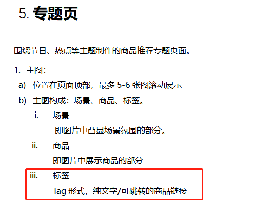

# 需求

## 功能需求

  

## 标注要求

标注需要tag形式、文字形式、链接形式

## 实现方式调研

### 1. Canvas 画图操作，之后将图片上传给后端

常见的实现方式：

- gDBox.js
- [https://github.com/Moonburni/pictureShadow](https://github.com/Moonburni/pictureShadow)

优点：纯前端操作，不管是CMS还是其他前端项目，直接使用图片即可，无需二次操作  
缺点：不支持点击标注跳转功能

### 2. SVG的方式，生成SVG，之后将SVG图片上传到后端

常见的实现方式：

- [https://github.com/Mcbai/labelImg](https://github.com/Mcbai/labelImg)
- 纯SVG操作等等  

优点：生成的图片体积小，可以随意放大，支持标注点击跳转事件  
缺点：支持性不是很好，早小程序可能无法使用

### 3. jQuery 操作标注，将操作后的信息返回给后端

常见的实现方式：

- [https://github.com/codingdogs/imageLabel](https://github.com/codingdogs/imageLabel)
- [https://github.com/geek-dc/jquery.imgmark.js](https://github.com/geek-dc/jquery.imgmark.js)  

优点：编写简单，支持标注点击跳转事件，只传信息，不传图片  
缺点：需要再前端进行二次处理，CMS为vue项目，一般不建议使用jQuery

### 4. Img 标签的点击区域功能

常见的实现方式：

  ```html
    

    <map name="planetmap" id="planetmap">
      <area shape="circle" coords="180,139,14" href ="venus.html" alt="Venus" />
      <area shape="circle" coords="129,161,10" href ="mercur.html" alt="Mercury" />
      <area shape="rect" coords="0,0,110,260" href ="sun.html" alt="Sun" />
    </map>
  ```

优点：html原生，兼容性好，书写简单  
缺点：自定义性不强，不支持小程序  

### 5. vue 原生实现，操作标注，将操作后的信息返回给后端  

常见的实现方式：  

  vue组件封装  

优点：支持标注点击跳转事件，只传信息，不传图片，和CMS一样是vue代码，无需引用其他依赖  
缺点：编写复杂  

## 最终的确定方案

采用上方的第5中实现方式：

1. 使用原生的vue直接开发
2. 不生成图片，直接将前端的操作信息返给后端
3. tag点取消事件冒泡
4. 记录图片大小和tag点坐标，换算成比例返给后端
5. 根据点击点坐标，兼容tag坐标，包括太靠近边缘处理，点击点应该位于tag的中心，标注不可出图片范围，设置4中位置【左上、左下、右上、右下】
6. cms只管编辑的样式，不管展示的样式，将所有的必须的信息返给后端，后端返给前端，前端自己定义展示样式

## 备注

暂时考察，这个功能是可以实现的，但是还要根据具体的PRD就行判断
