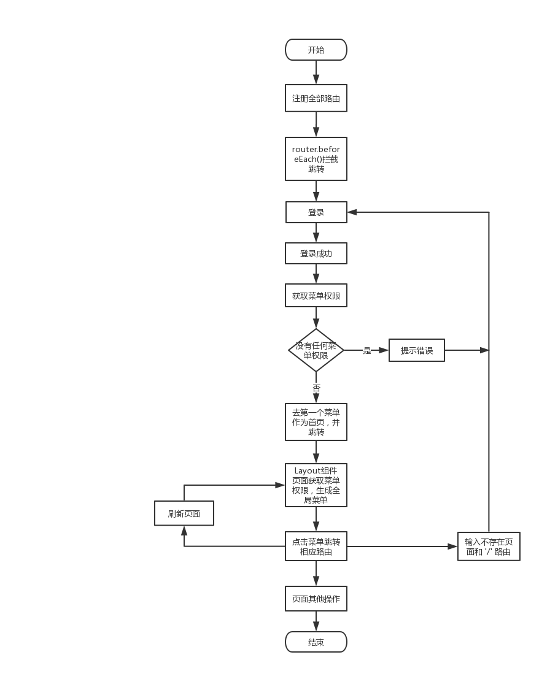
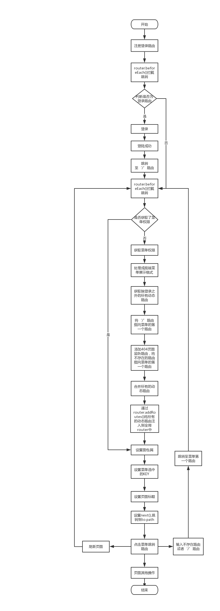

# 前端路由权鉴

当这个系统框架搭建的时候，并不知道网站的具体逻辑和需求，所以在具体的实现过程中就有不足或者不适合这套业务逻辑的地方。  
现在此系统已经迭代了几个版本了，同时也开始趋向于稳定，这个时候就可以去解决以前遗留的问题了。  
本次的优化主要是针对路由跳转、路由权鉴相关的东西。

## 方舟系统现存路由跳转问题

1. 页面标题不随着路由跳转而变化，用户体验不好
2. 点击面包屑无法返回对应的页面
3. 刷新页面当前菜单的选中样式消失
4. 整个系统无首页，登录时需要多请求一次菜单列表接口，以获取第一个菜单做为首页
5. 整个系统的404处理，都跳转到登录页面，这并不合理，同时这也是由没有首页造成的
6. 不管有没有对应页面的权限，都会把页面注册到路由当中，当不通过菜单而是直接使用链接跳转时，仍然可以跳转到对应页面，页面会展示，但是接口会报没有权限的错误。理想的情况是，跳转到首页或者无权限提示页，不进行接口调用

以上是本系统路由相关存在的问题，接下来我们一条一条的去解决。

## 开始之前，配置路由的 meta 对象

在我们添加路由的时候，可以给每一个路有一个mate对象，用以记录该路由相关的信息，大概的格式如下：

```javascript
/**
 * 活动管理
 */
import layout from '@/components/layout'
import goldCoin from '@/routes/activityManager/goldCoin'

export default {
  path: '/activityManager',
  meta: {title: '活动管理', crumbs: [{path: '', name: '活动管理'}]},
  component: layout,
  children: [
    {
      name: 'goldCoin',
      path: '/activityManager/goldCoin',
      meta: {
        title: '金币兑换活动',
        crumbs: [{path: '', name: '金币兑换活动'}]
      },
      component: goldCoin
    }
  ]
}
```

meta中包含着title属性，和crumbs数组。通过字段的名称我们就可以知道title是每个路由对应的页面标题，而crumbs记录每个路由的面包屑，面包屑中包含着名称和对应的路由。  
我们要为每个需要标题、需要面包屑的页面配置mate对象，但是像登录页面这样无需面包屑的路由，可以配置成空数组也可以不去配置。  
现在很多的系统的路由权鉴也是放到mate当中，判断是否需要权限。但是我这里做的路由权鉴是根据vue-router新的API **addRoutes()** 进行的，所以这里不需要添加权鉴字段。  
除了以上的添加到mate的内容为，还有一个菜单对应的key值也要放到mate中，就是当路由切换时选中对应菜单和刷新时默认选中对应菜单时需要用到的一个值。不过这个值是动态设置的，会在设置时具体细说。

## 页面标题问题解决

这个问题的解决方法比较简单，在配置好meta之后，在系统路由配置中添加beforeEach钩子：

```javascript
router.beforeEach((to, from, next) => {
  let toPath = to.path
  if (toPath === '/login') {
    document.title = '登录 -- 必要方舟系统'
  } else {
    document.title = to.meta && to.meta.title ? `${to.meta.title} -- 必要方舟系统` : '必要方舟系统'
  }
  next()
})
```

通过meta中的title设置document.title即可

## 全局菜单权限获取逻辑

在解决其他问题之前，都需要先获取菜单权限或者可以叫做路由权限，原有的逻辑如下：



可以看出来，调用了两次获取菜单权限的接口，其他未注册路由会跳转到登录页，以菜单的第一个路由作为登录成功的跳转页面。

优化之后的全局菜单权限获取的逻辑变成了这样子：



可以看出来，优化之后全局只调用一次获取菜单权限的接口，同时，在优化的过程中设置了面包屑和菜单选中时的KEY。当然最重要的是动态的去注册全局路由，从而不会出现跳转到具体页面，但是后端报接口无权限的错误，优化用户体验。

上面是大概的流程，接下来具体的讲解一下代码实现。

## 获取全部动态路由

本项目的所有路由都放到了src/router下面，每一个一级目录为一个JS文件，其中还包含登录的路由和router的主文件index.js。而我们现在要做的就是获取到除了login.js和index.js之外的所有的路由，用以动态注册。如果一个一个的加，开发会很累，同时每增加一个一级页面就要跟新一下保存所有动态路由的地址，会很烦。所以这里我是使用 require.context() 来遍历了文件夹下的所有文件，直接获取路由数组。具体代码如下：

```javascript
const getAllFiles = (exclude = ['login', 'index']) => {
  let files = require.context('@/router/', false, /.(js)$/).keys()
  files = files.map(item => item.replace(/(\.\/)|(\.js)/ig, ''))
  files = files.filter(item => exclude.indexOf(item) === -1)
  return files
}

// 获取除了 ['login', 'index'] 之外的所有的动态路由路径
const moduleList = getAllFiles(['login', 'index'])

const getModules = (paths) => {
  const moduleArr = []
  for (let i = 0; i < paths.length; i++) {
    let current = require('@/router/' + paths[i] + '.js').default
    moduleArr.push(current)
  }
  return moduleArr
}

// 获取路径对应的文件内容
const data = getModules(moduleList)

export default data
```

要注意的是其中的require的地址要动态的拼接，不能直接赋值以变量，否则会报错

然后将路由数组赋值给到vuex中的state上的allRouters属性

## 获取菜单权限

这里将登录页和Layout页中的获取菜单权限的函数去掉，统一放到vuex的actions中，当路由切换但是菜单权限为空时，就去触发action，然后根据获取的菜单权限再重新注册动态路由。如果菜单权限不为空，则不触发action，只设置面包屑和菜单选中的KEY。这里我将动态路由数组也放到了actions中进行设置。

```javascript
// store/index.js
// import Vuex from 'vuex'
import Vue from 'vue'
import Vuex from 'vuex'

import global from './modules/global'
import allRouters from './dynamicRouter'
import service from '../services'

Vue.use(Vuex)
const store = new Vuex.Store({
  state: {
    crumbs: 'crumbs', // 面包屑
    menuData: [],
    pathArr: {},
    allRouters: []
  },
  mutations: { // $store.commit('showLoading')
    updateCrumbs (state, val) {
      state.crumbs = val
    }
    setMenus (state, obj) {
      state.menuData = [...obj.menuData]
      state.allRouters = [...obj.allRouters]
    }
  },
  actions: {
    async getMenus (context) {
      const menuData = await service.account.listCascade({
        filterUserId: localStorage.user_id,
        resClass: 1,
        resType: 1
      })
      let item = null
      let e = null
      if (!menuData || menuData.length === 0) {
        this.$message.warning('您的账号还没有任何权限，请联系管理员添加相关权限')
      }
      for (let i = 0; i < menuData.length; i++) {
        item = menuData[i]
        for (let j = 0; j < item.subList.length; j++) {
          e = item.subList[j]
          e.path = context.state.pathArr[e.resCode] || ''
        }
      }
      context.commit('setMenus', {menuData, allRouters})
    }
  }
})

Vue.prototype.$store = store

export default store
```

在router/index.js中触发getMenus事件，获取菜单权限后更新menuData列表，然后在router中获取使用，具体的使用过程如下：

```javascript
import Vue from 'vue'
import Router from 'vue-router'
import store from '../store'

import login from './login'
router.beforeEach((to, from, next) => {
  let toPath = to.path
  let menus = store.state.menuData // 获取菜单
  if (toPath === '/login') {
    document.title = '登录 -- 必要方舟系统'
  } else {
    // 菜单添加
    if (!menus.length) {
      // 没有菜单时获取菜单
      await store.dispatch('getMenus') // 调用获取菜单接口
      menus = store.state.menuData
      let routers = store.state.allRouters // 获取代注册的路由数组
    } else {
      // do someting
    }
    document.title = to.meta && to.meta.title ? `${to.meta.title} -- 必要方舟系统` : '必要方舟系统'
  }
  next()
})
```

## 处理后台返回数据以适应前端菜单展示

具体的处理过程不在这里详解了，因为不具备复用性，想了解的话请直接查看方舟代码。但是这个处理过程一定要有的，因为后端返回来的权限数据一般来说是没法直接用在菜单展示上面的。

## 动态注册路由

router.addRoutes() 是vue-router提供的、可以动态注册路由的钩子，我们使用它来进行动态注册路由。  
同时将不存在的路由和'/'路由也注册到全局中。

```javascript
import Vue from 'vue'
import Router from 'vue-router'
import store from '../store'

import login from './login'
router.beforeEach((to, from, next) => {
  let toPath = to.path
  let menus = store.state.menuData // 获取菜单
  if (toPath === '/login') {
    document.title = '登录 -- 必要方舟系统'
  } else {
    // 菜单添加
    if (!menus.length) {
      // 没有菜单时获取菜单
      await store.dispatch('getMenus')
      menus = store.state.menuData
      let routers = store.state.allRouters
      let newRouters = []
      let menuList = []
      menus.forEach(item => {
        if (item.subList.length) {
          menuList.push(...item.subList)
        }
      })
      menuList = menuList.map(item => item.path)
      let keys = []
      routers.forEach(superRouter => {
        superRouter.children.forEach(subRouter => {
          if (menuList.indexOf(subRouter.path) > -1) {
            keys.push(subRouter.meta.key)
          }
        })
      })
      newRouters = routers.map(superRouter => {
        const item = {...superRouter}
        item.children = []
        superRouter.children.forEach(subRouter => {
          if (keys.indexOf(subRouter.meta.key) > -1) {
            item.children.push(subRouter)
          }
        })
        return item
      })
      // '/' 和 其他意外的路由指向后端返回菜单中的第一个
      toPath = toPath === '/' ? menuList[0] : toPath

      const otherRouters = {
        path: '*',
        redirect: toPath
      }
      newRouters.push(otherRouters)
      router.addRoutes(newRouters)
      next({path: toPath})
    } else {
      // do someting
    }
    document.title = to.meta && to.meta.title ? `${to.meta.title} -- 必要方舟系统` : '必要方舟系统'
  }
  next()
})
```

登录之后会跳转到 '/' 路由，这个时候会进行拦截，将这个路由指向菜单的第一个路由。

## 面包屑处理

当有了菜单权限，注册了全局路由，这个时候就会进到具体的页面，在进入页面前，需要先处理面包屑。

```javascript
import Vue from 'vue'
import Router from 'vue-router'
import store from '../store'

import login from './login'
router.beforeEach((to, from, next) => {
  let toPath = to.path
  let menus = store.state.menuData // 获取菜单
  if (toPath === '/login') {
    document.title = '登录 -- 必要方舟系统'
  } else {
    // 菜单添加
    if (!menus.length) {
      // 没有菜单时获取菜单
      await store.dispatch('getMenus')
      menus = store.state.menuData
      let routers = store.state.allRouters
      let newRouters = []
      let menuList = []
      menus.forEach(item => {
        if (item.subList.length) {
          menuList.push(...item.subList)
        }
      })
      menuList = menuList.map(item => item.path)
      let keys = []
      routers.forEach(superRouter => {
        superRouter.children.forEach(subRouter => {
          if (menuList.indexOf(subRouter.path) > -1) {
            keys.push(subRouter.meta.key)
          }
        })
      })
      newRouters = routers.map(superRouter => {
        const item = {...superRouter}
        item.children = []
        superRouter.children.forEach(subRouter => {
          if (keys.indexOf(subRouter.meta.key) > -1) {
            item.children.push(subRouter)
          }
        })
        return item
      })
      // '/' 和 其他意外的路由指向后端返回菜单中的第一个
      toPath = toPath === '/' ? menuList[0] : toPath

      const otherRouters = {
        path: '*',
        redirect: toPath
      }
      newRouters.push(otherRouters)
      router.addRoutes(newRouters)
      next({path: toPath})
    } else {
      if (to.meta && to.meta.crumbs && to.meta.crumbs.length) {
        crumbs = to.meta.crumbs
        let params = to.params ? to.params : {}
        crumbs = crumbs.map(item => {
          let arr = item.path.split('/:')
          if (arr.length > 1) {
            arr = arr.map((sItem, idx) => {
              if (idx) {
                sItem = params[sItem]
              }
              return sItem
            })
          }
          item.path = arr.join('/')
          return item
        })
      }
    }
    document.title = to.meta && to.meta.title ? `${to.meta.title} -- 必要方舟系统` : '必要方舟系统'
  }
  next()
})
```

## 处理路由切换菜单不选中问题

我们这里为菜单的每一项设置一个KEY，当前路由的KEY变化时，菜单随之切换选中状态。  
我这里使用的是每个路由自己的唯一标识代表菜单的KEY，同时把变化后的KEY通过crumbs面包屑传给菜单，具体实现如下：

```javascript
import Vue from 'vue'
import Router from 'vue-router'
import store from '../store'

import login from './login'

Vue.use(Router)

const router = new Router({
  routes: [
    login
  ]
})

router.beforeEach(async (to, from, next) => {
  let crumbs = []
  let toPath = to.path
  let menus = store.state.menuData
  if (toPath === '/login') {
    document.title = '登录 -- 必要方舟系统'
    next()
  } else {
    // 菜单添加
    if (!menus.length) {
      // 没有菜单时获取菜单
      await store.dispatch('getMenus')
      menus = store.state.menuData
      let routers = store.state.allRouters
      let newRouters = []
      let menuList = []
      menus.forEach(item => {
        if (item.subList.length) {
          menuList.push(...item.subList)
        }
      })
      menuList = menuList.map(item => item.path)
      let keys = []
      routers.forEach(superRouter => {
        superRouter.children.forEach(subRouter => {
          if (menuList.indexOf(subRouter.path) > -1) {
            keys.push(subRouter.meta.key)
          }
        })
      })
      newRouters = routers.map(superRouter => {
        const item = {...superRouter}
        item.children = []
        superRouter.children.forEach(subRouter => {
          if (keys.indexOf(subRouter.meta.key) > -1) {
            item.children.push(subRouter)
          }
        })
        return item
      })
      // '/' 和 其他意外的路由指向后端返回菜单中的第一个
      toPath = toPath === '/' ? menuList[0] : toPath

      const otherRouters = {
        path: '*',
        redirect: toPath
      }
      newRouters.push(otherRouters)
      router.addRoutes(newRouters)
      next({path: toPath})
    } else {
      // 面包屑设置
      if (to.meta && to.meta.crumbs && to.meta.crumbs.length) {
        crumbs = to.meta.crumbs
        let params = to.params ? to.params : {}
        // 处理多级动态参数问题，暂时不支持 /account/roleAllot/:id/account/:name 格式
        // 支持 /account/roleAllot/:id/:account/:name 格式
        crumbs = crumbs.map(item => {
          let arr = item.path.split('/:')
          if (arr.length > 1) {
            arr = arr.map((sItem, idx) => {
              if (idx) {
                sItem = params[sItem]
              }
              return sItem
            })
          }
          item.path = arr.join('/')
          return item
        })
        // 为每个面包屑的第一个加KEY，以将当前的菜单设置成激活样式
        // 根据路由切换菜单选择高亮
        for (let i = 0; i < menus.length; i++) {
          let item = menus[i]
          for (let j = 0; j < item.subList.length; j++) {
            let e = item.subList[j]
            if (crumbs[0].path) {
              if (e.path === crumbs[0].path) {
                crumbs[0].key = e.id
                store.commit('updateCrumbs', [...crumbs])
              }
            } else if (e.path === toPath) {
              crumbs[0].key = e.id
              store.commit('updateCrumbs', [...crumbs])
            }
          }
        }
      }
      // 页面标题设置
      document.title = to.meta && to.meta.title ? `${to.meta.title} -- 必要方舟系统` : '必要方舟系统'
      next()
    }
  }
})

export default router
```

## Layout中对应的代码实现

```html
<!-- 面包屑 -->
<div class="crumbs" :class="{collapse: collapse}">
  <template v-for="(crumb, idx) in $store.state.crumbs">
    <span :key="crumb.key">
      <span class="split" v-if="idx">/</span>
      <router-link v-if="crumb.path" :to="crumb.path">{{crumb.name}}</router-link>
      <span v-else>{{crumb.name}}</span>
    </span>
  </template>
</div>
```

```html
<!-- 左侧菜单 -->
<div class="left-content">
  <div class="menu">
    <el-menu :default-active="$store.state.crumbs[0].key" background-color="#545c64" text-color="#fff" active-text-color="#ffd04b" :collapse="collapse">
      <el-submenu v-for="(item, i) in $store.state.menuData" :key="i" :index="item.id" >
        <template slot="title">
          <i :class="[item.icon || 'el-icon-location']"></i>
          <span v-text="item.resName"></span>
        </template>
        <el-menu-item v-for="(e, i) in item.subList" :key="i" :index="e.id">
          <router-link :to="e.path" v-text="e.resName"></router-link>
        </el-menu-item>
      </el-submenu>
    </el-menu>
  </div>
</div>
```

## 最后

经过一些列的更改和优化已经解决了最开始提出的6个问题。经过自测没有发现问题，之后会同步到测试人员处，以保证上线运行的稳定性。

具体的项目代码地址：[方舟系统代码](http://192.168.99.68/support/ark.git)，有兴趣的可以去看一下。

如果有更好的建议或者实现的有问题请及时提出。
